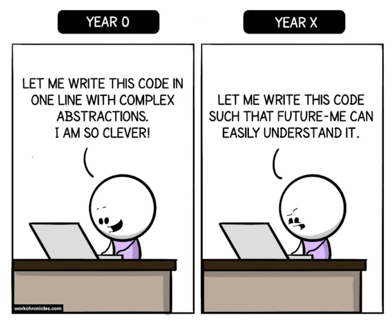

I remember when I was in college, I was writing variables in acronym form beacause its faster. That habit stay for a long time until one day, when we are short on time for our group project, when we are about to compile all of our code together, there was a lot of complications arise from my work. my variables are confusing and unreadble. In the end, we manage to get by with the help of others who are willing to lend our group a peice of their code. But that day, I learned a valuable lesson of why a “Working” code is not the same as “Good” code.

Code that produces the correct output is often considered “finished,” especially in academic or beginner projects. However, in real-world engineering, working code is only the starting point. Good code must also be readable, maintainable, and reliable over time.

Working code can still be problematic if it is difficult to understand. Can you imagine improving the code of the company of your newly applied job only for you to see variables written in Chinese characters? Poor naming, lack of structure, and missing documentation make future changes risky. When code is hard to read, even its original author may struggle to debug or extend it later. In team environments, unclear code slows collaboration and increases the likelihood of errors.

Good code also considers scalability and robustness. A solution that works for a small dataset or limited use case may fail when requirements grow. Handling edge cases, validating inputs, and planning for future features are signs of thoughtful engineering rather than quick fixes.

Ultimately, good code reflects a professional mindset. It is written not just for machines, but for other engineers—and for the future. While working code solves today’s problem, good code reduces tomorrow’s problems. This distinction is what separates programming as a task from software engineering as a discipline.

Ultimately the question you should really ask yourself if something if particularly difficult is then "is it worth it"? That is something that is context specific and only you can answer yourself.
