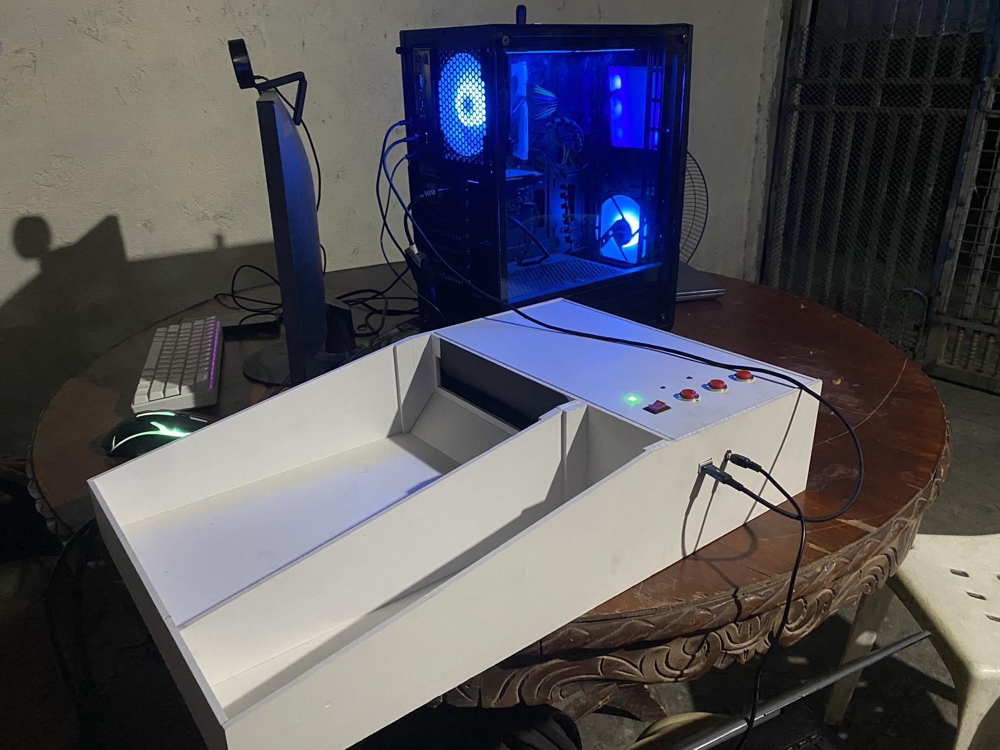
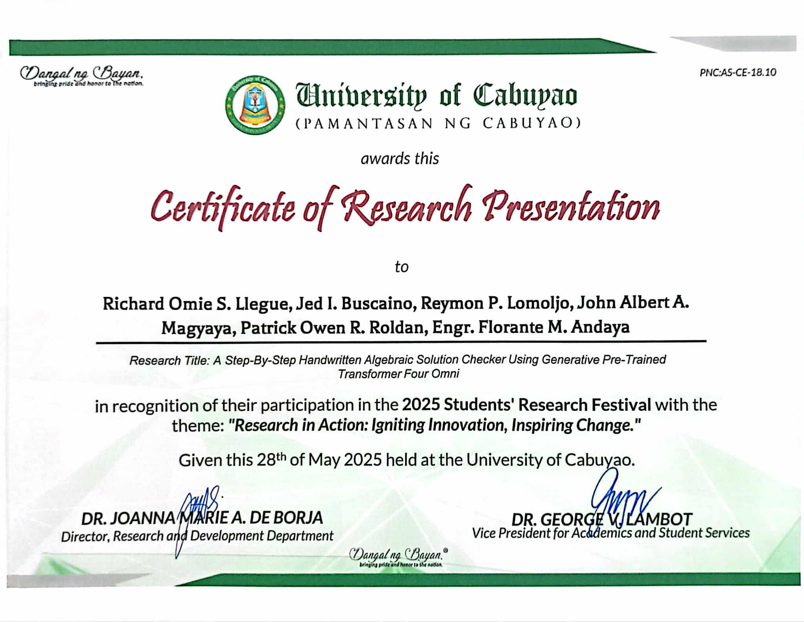
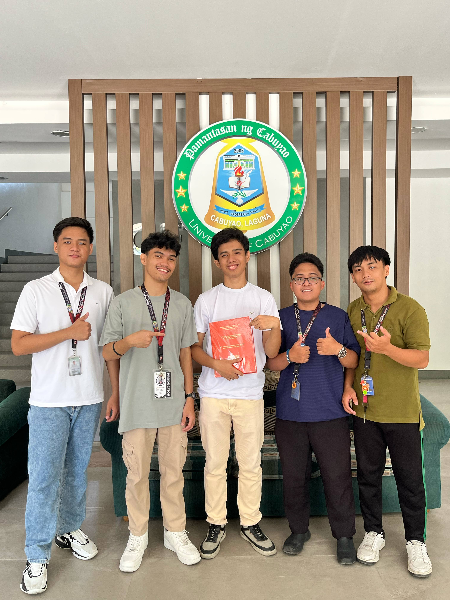

  
  
  

This study aimed to develop an automated step-by-step Handwritten Algebraic
Solution (HAS) checker through Generative Pre-Trained (GPT-4.0)-4o and Optical
Character Recognition (OCR) integration to evaluate handwritten algebra solutions
with corrections for mistake answers. The main purpose is to measure reduction in
the time spent in manual grading of HAS, because traditional methods often take a
considerate amount of time. With the advancement of technology like Artificial
Intelligence (AI) to enhance the process of assessment of grading. The user would
initially provide an answer key to have a basis on checking HAS of students. Answer keys and HAS were extracted using OCR turning into Latex code. Afterwards, the fine-tuned GPT-4o would compare both solutions and grade the HAS, putting corrections in mathematical mistakes. Additionally it asked the user for confirmation when encountering an Alternative Solution Method (ASM). The researchers conducted observations and comparative analyses with 5 math instructors and 5 field experts to evaluate system accuracy, processing speed, and adaptability based on ISO/IEC 25010 standards. An average of 4.3 over 5 in overall evaluation, and runtime of approximately 11 seconds for each HAS evaluation.

For this project, I was the "Lead Embedded Systems Engineer" who was responsible for hardware designing, assembly, and firmware. It all started when I suggest to my team to develop a simple paper feeding mechanism similar to a printer to further provide a solution to the time-consuming aspect of manual grading. It was a machanism where a person just needed to put the papers in the slot, the paper goes in one at a time, then gets processed.

What I did first is recycle an old broken printer, disassemble it and begun studying how it works. With some research I manage to figure out how printers work from the insides. After that, with the help of my dad, we manage to remove uneccessary parts of the printer only leaving the feeding mechanism intact. After that, I started planning, and modifying some parts of the feeder like the feed rollers, and program the firmware needed. I ended up creating the algorithm of the firmware to be inspired by how real printers work with some custom modifications. The next step I took was design the casing for our project and with the use of CAD software, I manage to do so and we commissioned the casing from an expert. The final step is to incorporate the software with the hardware to work together which after hours of collaboration with the team's lead programmer, we manage to complete and had it working. In the end we ended up creating a mechanism that can process 50+ papers with a click of a button in minutes.

Other contributions include designing and implementing our database structures which uses indexing for optimization, and data gathering. Thanks to all of our hardwork, we ended up getting "Best in Thesis" from our program.
